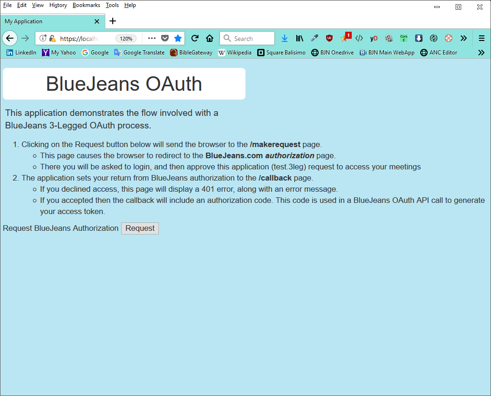
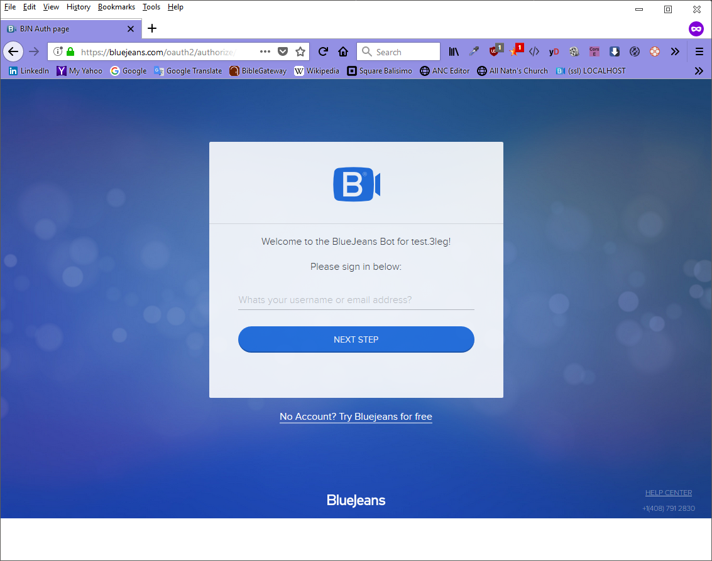
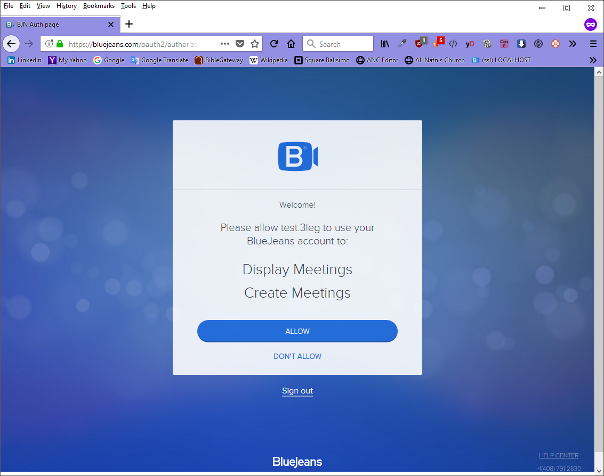
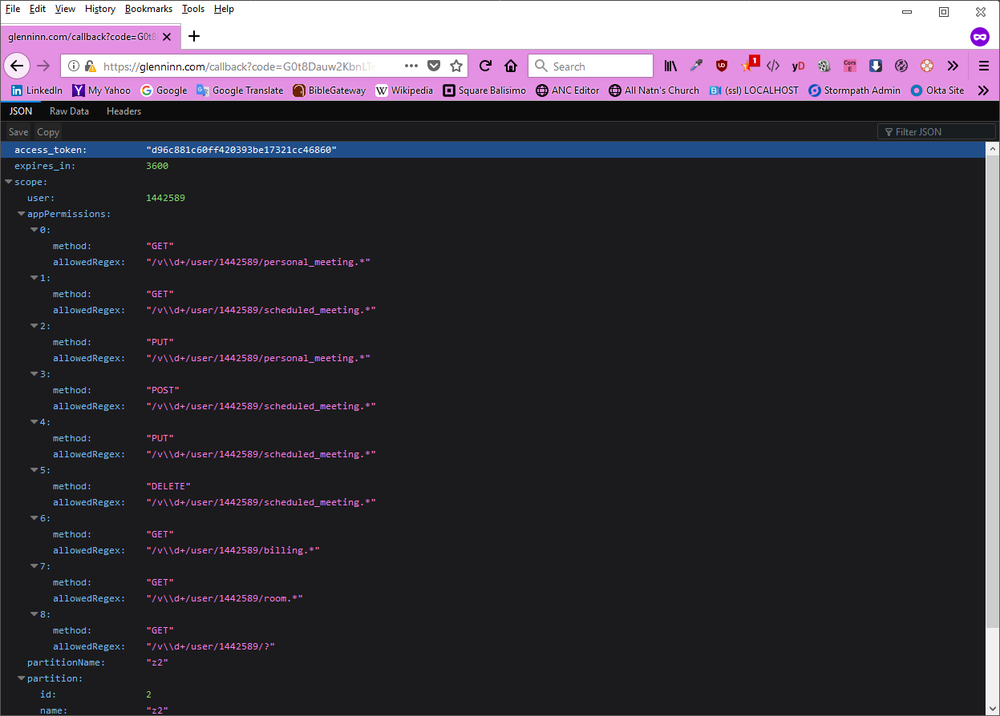
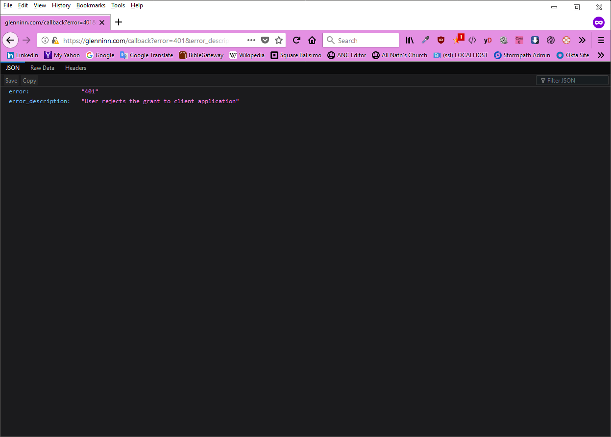

# Test3Leg - a NodeJS App Demonstrating the BlueJeans 3-Legged OAuth Process

- 8/6/2018, g1, Fill out READ.me with more comprehensive step-by-step description of process flow.
- 7/24/2018, g1, Initial Check-in

This reference design creates a simple web site that supports the 3-Legged OAuth process for obtaining application access to a user's BlueJeans meetings. 

**Note:** To run this test application, you must pre-configure the following two parameters:

1. Edit your Operating System's host file to map "glenninn.com" to localhost
2. Called the BlueJeans API `/v1/user/{user_id}/developer_applications` to create an Oauth Client definition for this *Test Application* 


## Setup

To use the Test3Leg, you will need to have the Node JS environment including the package manager too, **npm**.


- Download the contents of this github to your computer.  Then run the initialization  `npm install` to have npm download and install the npm modules


### Register/Create Test Application's OAuth Information

To ensure that BlueJeans knows about this Test Application, you will need to have run the API  `/v1/user/{user_id}/developer_applications`  with the following parameters:

```javascript
{
  appName : "test.3leg",
  description : "Reference Application to test 3-legged authentication",
  appLogoUrl : "",
  redirectUrls : [
    "https://glenninn.com"
  ]
}
```

The results of the API call will be the registration information, including an OAuth **clientSecret** key.  You must write down/save the clientSecret key value as it will not be shown again.  If you lose this key, you can call an API to regenerate a new value.  However, you will have to update your application with the new clientSecret value

```javascript
  {
    description : "Reference Application to test 3-legged authentication",
    appLogoUrl : "https://glenninn.com/Logo-84x84.png",
    redirectUrls : [
      "https://glenninn.com"
    ],
    clientId :  "43160b229 ... 18ef2c3ef00989bec",
    clientSecret : "xxxxxxx",
    appName : "test.3leg",
    client_id : "43160b229 ... 18ef2c3ef00989bec",
    client_secret : "xxxxxxxx"
  },
```


### Configure Test Application's appinfo.json

Ensure that you have created an`appinfo.json` configuration file.  (The project includes a template example of the file in `appinfo.example.json`)   The file needs to include the `client_secret` key.  If you have forgotten the key, you must regenerate one and put that value into the appinfo.json file.

```javascript
{   
  "appLogoUrl": "https://glenninn.github.io/bjn-test3leg/html/Logo-84-84.png",
  "redirectUrls": [
      "https://glenninn.com/callback",
	  "https://glenninn.com/authenticated"
  ],  
  "appName": "test.3leg",
  "client_id": "43160b229 ... 18ef2c3ef00989bec",
  "client_secret": "xxxxxxx"
}
```

### Create Local Alias for glenninn.com

Edit your operating system host file to create a local alias that maps:

` glenninn.com --> localhost`

 

## Running The Application
Launch the node web server by typing

`node index.js`

You should see something similar to this in the shell window:

```javascript
C:\Users\glenn\Documents\node\test3Leg>node index
***Test 3 Leg OAuth Server ****
HTTPS Server listening on port: 443
Loaded App Configuration
{
  "appLogoUrl": "",
  "redirectUrls": [
    "https://glenninn.com/callback",
    "https://glenninn.com/authenticated"
  ],
  "appName": "test.3leg",
  "client_id": "43160b22923645618ef2c3ef00989bec",
  "client_secret": "..."
}
```


## Launching a Client Application Session

To simulate how a *Test Application* user would grant access to BlueJeans, start a web client session.


- Open your browser and then browse to:

` http://glenninn.com

At this point you should see the following screen:




To start an Oauth 3-Legged session, click on the **Request** button.  


## Application Requesting Client Access to BlueJeans

Clicking the **Request** button connects the user's browser to the /makerequest page on the *Test Application* **server**.

Accessing the /makerequest page causes the following to happen:

- the *Test Application* **server** constructs the BlueJeans API `https://bluejeans.com/oauth2/authorize`  <u>Note</u> the URL for this API goes directly to bluejeans.com, and **not** api.bluejeans.com
- The API parameters are passed as query parameters
- The server send the user browser a redirect command to send the user to BlueJeans for authorizing the application with access his or her BlueJeans' account.

| Query Parameter | Authorize Function Description                               |
| --------------- | ------------------------------------------------------------ |
| clientId        | This is the client_id key that was created for the *Test Application* by the BlueJeans Administrator |
| redirectUri     | One of the registered URL's associated with *Test Application*.  Alternatively, it can be a page from a domain registered for *Test Application* |
| state           | This is an application-specific value that is used to help prevent phishing |
| scope           | This parameter is a comma-separated list of functions that BlueJeans will allow the Test Application to perform.  Typically this list is  "list_meetings,modify_meetings,user_info" |
| responseType    | The responseType tells BlueJeans how to return a "success value" if the user successfully authorizes access.  Typically this is set to "code" |
| appName         | The App Name is the name of the application registered with BlueJeans. |
| appLogoUrl      | The App Logo URL directs what image should be used on the BlueJeans authorization page to show "co-branding" of *Test Application* and BlueJeans |


The user should now see a BLueJeans page that looks like this:




The user simply enters his or her BlueJeans user ID and clicks on **Next Step** 


When the user confirms access by clicking on **Sign In**,  the BlueJeans page will ask the user to confirm that he or she wants to grant the *Test Application* access to DIsplay and Create Meetings.



Clicking on **Allow** will cause BlueJeans to return the user to the *Test Application* via the redirectUri specified in the API call.  In this case, the redirectUri will cause the user's browser to visit https://glenninn.com/callback.

The *Test Application*'s <u>/callback</u> page receives the result of the Authorization process from BlueJeans.  Depending on the result of the authorization, *Test Application* concludes by displaying one of the following pages

#### Authorization Succeeds

*Test Application* takes the authorization <u>code</u> returned from BlueJeans and then calls the API`/oauth2/token?Code` to exchange that code for an access_token.  The results of that exchange (which should be the access token JSON object) are returned to the user's web session:




#### Authorization Fails

Upon failure of authorization,  *Test Application* returns to the user's web session the error information in a JSON error object.


```

```